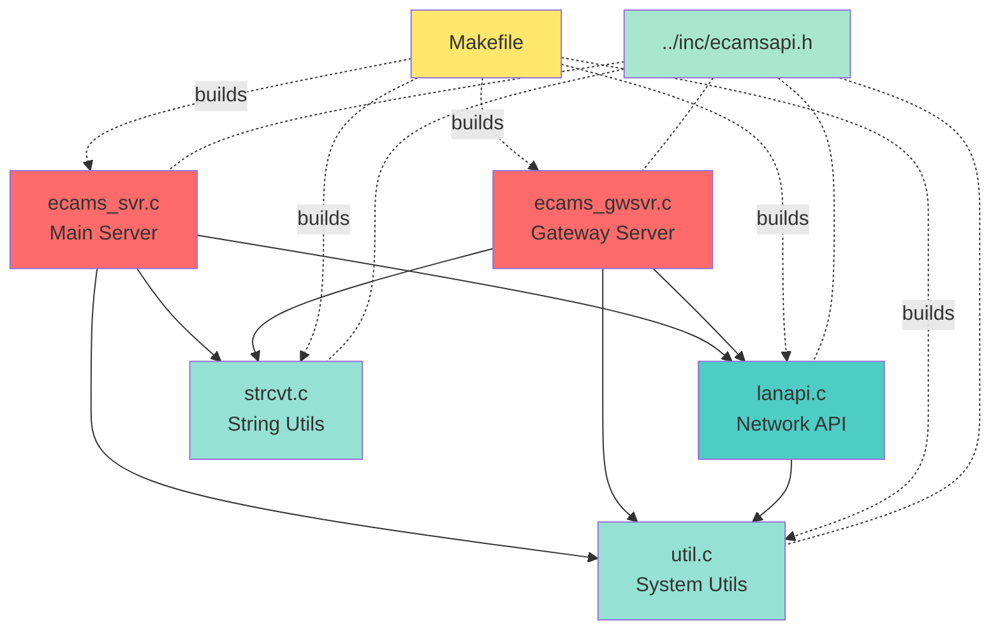

# ECAMS 서버 소스 디렉토리 구조 분석 보고서

## 📋 개요

**분석 대상 디렉토리**: `D:\업무_KCS\R_D\Antigravity-git\agentupgrade\serverupgrade\server\src\server\svrsrc`

**분석 일시**: 2026년 1월 26일

**목적**: ECAMS (Enterprise Change & Asset Management System) 서버 소스코드의 전체 구조 파악 및 문서화

---

## 📁 디렉토리 구조

```
svrsrc/
├── Makefile              (417 bytes)
├── Makefile.in           (425 bytes)
├── ecams_gwsvr.c         (36,916 bytes)
├── ecams_svr.c           (38,659 bytes)
├── lanapi.c              (21,332 bytes)
├── strcvt.c              (16,297 bytes)
└── util.c                (21,833 bytes)
```

**총계**: 
- 디렉토리: 0개
- 파일: 7개
- 총 크기: ~135 KB

---

## 🔧 빌드 설정 파일

### 1. Makefile / Makefile.in

두 파일은 거의 동일하며, Makefile.in은 autoconf 템플릿 버전입니다.

**주요 설정**:
- **컴파일러**: `cc` (Makefile) / `@CC@` (Makefile.in - autoconf 변수)
- **컴파일 플래그**: `-g` (디버그 모드) / `@CFLAGS@` (autoconf 변수)
- **인클루드 경로**: `-I. -I../inc`

**빌드 타겟**:
1. `lanapi` - LAN API 모듈
2. `strcvt` - 문자열 변환 모듈
3. `util` - 유틸리티 모듈
4. `ecams_svr` - ECAMS 서버 메인 모듈

**빌드 프로세스**:
- 각 `.c` 파일을 `.o` 오브젝트 파일로 컴파일
- 컴파일된 오브젝트 파일을 `../object` 디렉토리로 이동
- `clean` 타겟: 오브젝트 파일 및 core 파일 삭제

---

## 📄 소스 파일 상세 분석

### 1. ecams_gwsvr.c (Gateway Server)

**크기**: 36,916 bytes (1,202 lines)  
**프로그램명**: ecams_gwsvr.c  
**역할**: ECAMS 게이트웨이 서버 - 외부와의 통신을 중개하는 서버

#### 주요 함수 (27개 함수):

**디렉토리 관리**:
- `Local_Dir_Make2()` - 사용자/그룹/권한을 지정하여 디렉토리 생성
- `Local_Dir_Make()` - 기본 디렉토리 생성

**로깅**:
- `Agent_log()` - 에이전트 로그 기록

**시그널 처리**:
- `ExitParentProc()` - 부모 프로세스 종료 시그널 핸들러
- `DefineParentSignal()` - 부모 프로세스 시그널 정의
- `ExitChildProc()` - 자식 프로세스 종료 시그널 핸들러
- `DefineChildSignal()` - 자식 프로세스 시그널 정의
- `sig_cld()` - OSF 플랫폼 전용 자식 시그널 처리

**소켓 통신**:
- `HandleMainProc()` - 소켓 처리 결과 수신 메인 핸들러
- `main()` - 프로그램 진입점
- `ProcReadData()` - 소켓 데이터 수신
- `ProcRecvData()` - 송신 데이터 수신 처리

**파일 처리**:
- `ProcFileSnd()` - 파일 전송 처리
- `ProcFileRcv()` - 파일 수신 처리
- `ProcFileInf()` - 파일 정보 읽기
- `GetFileInf()` - 파일 정보 가져오기

**시스템 명령**:
- `ProcSystemCmd()` - 시스템 명령 처리
- `ProcDECrypt()` - 암호화/복호화 처리
- `ProcEnvGet()` - 환경 변수 및 DB 접속 정보 읽기

#### 특징:
- 클라이언트-서버 아키텍처의 게이트웨이 역할
- 파일 송수신 기능 지원
- 암호화 기능 내장
- 멀티프로세스 구조 (부모/자식 프로세스)

---

### 2. ecams_svr.c (Main Server)

**크기**: 38,659 bytes (1,239 lines)  
**프로그램명**: ecams_svr.c  
**역할**: ECAMS 메인 서버 - 핵심 서버 로직 처리

#### 주요 함수 (28개 함수):

ecams_gwsvr.c와 유사한 구조이지만 추가 기능 포함:

**전역 변수**:
```c
int      gFileSize;           // 파일 크기
char     gFileDate[20];       // 파일 날짜
char     gFileOwner[20];      // 파일 소유자
char     gFileGroup[20];      // 파일 그룹
char     gFileMode[5];        // 파일 접근 권한
char     gSvrIP[20];          // 서버 IP
char     tarFilename[512];    // TAR 파일명
char     idxFilename[512];    // 인덱스 파일명
int      indexrcvchk;         // 인덱스 수신 체크
int      gFileSendflag;       // 파일 전송 플래그
int      myerrno;             // 시스템 오류 코드
```

#### 주요 차이점:
- TAR 파일 처리 기능 추가
- 인덱스 파일 관리
- 파일 메타데이터 관리 강화
- 더 복잡한 파일 전송 로직

---

### 3. lanapi.c (LAN API)

**크기**: 21,332 bytes (645 lines)  
**프로그램명**: lanapi.c  
**역할**: 네트워크(LAN) 통신 API 라이브러리

#### 주요 함수 (17개 함수):

**소켓 연결 관리**:
- `DisConnectSocket()` - 소켓 연결 해제
- `ServerSocketInit()` - 서버 소켓 초기화
- `ServerAcceptClient()` - 클라이언트 접속 대기
- `GetPeerName()` - 클라이언트 접속 상태 확인
- `ConnectClient2Server()` - 클라이언트-서버 연결
- `ConnectWait()` - 연결 대기
- `SetSocketOpt()` - 소켓 옵션 설정

**데이터 송수신**:
- `Rcv_Data_Sock()` - 소켓에서 데이터 수신
- `SendDataToSock()` - 소켓으로 데이터 전송
- `ReadDataFromSock()` - 소켓에서 데이터 읽기
- `ReadSizeDataFromSock()` - 지정된 크기만큼 데이터 읽기

**IP 주소 변환**:
- `CvtIPchr2ulong()` - 문자열 IP → Unsigned Long 변환
- `CvtIPulong2chr()` - Unsigned Long → 문자열 IP 변환

**통신 프로토콜**:
- `MakeCommHeader()` - 통신 헤더 조립 (서버간 통신용)

#### 특징:
- 저수준 소켓 프로그래밍 추상화
- TCP/IP 통신 지원
- 재사용 가능한 네트워크 API 제공

---

### 4. strcvt.c (String Conversion)

**크기**: 16,297 bytes (465 lines)  
**프로그램명**: strcvt.c  
**역할**: 문자열 처리 및 변환 유틸리티

#### 주요 함수 (21개 함수):

**문자열 검색**:
- `Char_Check()` - 특수 문자 검색 (INSTR 기능)
- `Right_Char_Check()` - 오른쪽에서 문자 검색

**공백 제거**:
- `trunc_char()` - 좌/우 공백 제거
- `rtrunc_char()` - 우측 공백 제거

**부분 문자열 추출**:
- `left_char()` - 왼쪽 n자리 추출
- `right_char()` - 오른쪽 n자리 추출
- `mid_char()` - 중간 부분 문자열 추출

**문자열 변환**:
- `rep_char()` - 특수 문자 치환 (Replace)
- `upper_char()` - 소문자 → 대문자 변환
- `lower_char()` - 대문자 → 소문자 변환

**문자열 비교**:
- `cmp_left_char()` - 왼쪽 문자열 비교
- `cmp_right_char()` - 오른쪽 문자열 비교
- `cmp_mid_char()` - 중간 문자열 비교
- `cmp_upper_char()` - 대소문자 무시 비교 (대문자 변환)
- `cmp_lower_char()` - 대소문자 무시 비교 (소문자 변환)

**전역 버퍼**:
```c
char str_make[8192];      // 작업 버퍼
char str_makeck[8192];    // 체크용 버퍼
```

#### 특징:
- Visual Basic/Oracle의 문자열 함수와 유사한 API
- 한국어(한글) 처리 고려
- 대용량 문자열 처리 지원 (8KB 버퍼)

---

### 5. util.c (Utility Functions)

**크기**: 21,833 bytes (611 lines)  
**프로그램명**: util.c  
**역할**: 시스템 유틸리티 함수 모음

#### 주요 함수 (24개 함수):

**날짜/시간 처리**:
- `Get_String_Time()` - 시스템 시간을 문자열로 반환
- `Get_Struct_Time()` - 시스템 시간을 구조체로 반환
- `Get_Sys_Date()` - 시스템 날짜 가져오기
- `Get_File_Date()` - 파일 날짜 가져오기
- `Get_Sys_Slash_Date()` - 구분자가 포함된 시스템 날짜
- `Get_Sys_Time()` - 시스템 시간 가져오기
- `Get_Sys_Time10()` - 시스템 시간 (8 bytes)
- `Get_Sys_Time20()` - 시스템 시간 (확장 버전)

**데이터 변환**:
- EBCDIC ↔ ASCII 변환 테이블 포함
- `ConvData2Unpack()` - 데이터 언팩 변환
- `UL2Ch4()` - Unsigned Long → 4 Char 변환
- `Pc2UnixPath()` - PC 경로 → Unix 경로 변환

**디버깅**:
- `DumpData()` - 버퍼를 16진수와 EBCDIC/ASCII로 덤프

**소켓 상태 확인**:
- `ExistSendData()` - 소켓 전송 가능 여부 확인
- `ExistReadData()` - 소켓 수신 데이터 존재 확인

**기타**:
- `BccCompute()` - BCC(Block Check Character) 계산
- `Usleep()` - 마이크로초 단위 슬립

#### 특징:
- EBCDIC 시스템과의 호환성 지원 (메인프레임 연동)
- 크로스 플랫폼 지원 (PC ↔ Unix)
- 네트워크 진단 도구 포함

---

## 🔗 의존성 분석

### 공통 헤더 파일
모든 소스 파일이 `<ecamsapi.h>`를 포함하며, 이는 `../inc` 디렉토리에 위치할 것으로 추정됩니다.

### 모듈 간 의존성



### 외부 라이브러리 의존성
- 표준 C 라이브러리 (stdio.h, stdlib.h, string.h, etc.)
- POSIX 소켓 라이브러리 (socket, bind, listen, etc.)
- 시그널 처리 (signal.h)
- 시간/날짜 (time.h, sys/time.h)

---

## 🏗️ 아키텍처 개요

### 시스템 구성

```
┌─────────────────────────────────────────────────┐
│           ECAMS Server System                   │
├─────────────────────────────────────────────────┤
│                                                 │
│  ┌──────────────┐        ┌──────────────┐      │
│  │ ecams_gwsvr  │◄──────►│  ecams_svr   │      │
│  │  (Gateway)   │        │  (Main Srv)  │      │
│  └──────┬───────┘        └──────┬───────┘      │
│         │                       │              │
│         └───────────┬───────────┘              │
│                     │                          │
│         ┌───────────▼───────────┐              │
│         │      lanapi.c         │              │
│         │   (Network Layer)     │              │
│         └───────────┬───────────┘              │
│                     │                          │
│         ┌───────────▼───────────┐              │
│         │  strcvt.c + util.c    │              │
│         │  (Utility Layer)      │              │
│         └───────────────────────┘              │
│                                                 │
└─────────────────────────────────────────────────┘
```

### 레이어 구조

1. **Application Layer** (최상위)
   - `ecams_svr.c` - 메인 비즈니스 로직
   - `ecams_gwsvr.c` - 게이트웨이 로직

2. **Network Layer** (중간)
   - `lanapi.c` - 소켓 통신 추상화

3. **Utility Layer** (하위)
   - `strcvt.c` - 문자열 처리
   - `util.c` - 시스템 유틸리티

---

## 💡 주요 기능

### 1. 파일 전송 시스템
- 파일 송신/수신 지원
- TAR 파일 처리
- 파일 메타데이터 관리 (크기, 날짜, 소유자, 권한)

### 2. 네트워크 통신
- TCP/IP 소켓 기반
- 클라이언트-서버 모델
- 게이트웨이 패턴 구현

### 3. 프로세스 관리
- 부모/자식 프로세스 구조
- 시그널 처리 (**SIGCHLD, SIGTERM, SIGINT, SIGQUIT**)
- 플랫폼별 분기 (OSF, AIX, Sun, etc.)

### 4. 암호화/보안
- `ProcDECrypt()` 함수를 통한 암호화 지원
- 환경변수를 통한 DB 접속 정보 관리

### 5. 로깅
- `Agent_log()` 함수를 통한 로깅
- `DumpData()` 함수를 통한 디버그 덤프

---

## 🔍 코드 특성 분석

### 플랫폼 지원
소스코드에서 다음 플랫폼을 지원하는 것으로 확인:
- **OSF** (Digital Unix)
- **AIX** (IBM Unix)
- **Sun Solaris**
- **기타 POSIX 호환 Unix**

조건부 컴파일 사용:
```c
#if defined(__STDC__) || defined(__cplusplus) || defined(__sun) || defined(_AIX)
#ifdef _OSF_SOURCE
```

### 코딩 스타일
- **언어**: C (K&R 및 ANSI C 혼용)
- **주석**: 한글 주석 사용
- **명명 규칙**: 
  - 함수: PascalCase 또는 Snake_Case
  - 변수: camelCase 또는 snake_case
- **들여쓰기**: 탭 사용

### 레거시 코드 특성
- 오래된 C 코드 스타일 (K&R 함수 선언)
- 전역 변수 사용
- `extern` 선언 다수 사용
- EBCDIC 지원 (메인프레임 연동 흔적)

---

## ⚠️ 발견된 이슈 및 개선 사항

### 잠재적 이슈

1. **보안**:
   - 버퍼 오버플로우 가능성 (`strcpy`, `sprintf` 대신 안전한 함수 사용 권장)
   - 평문 환경변수에 DB 접속 정보 저장

2. **이식성**:
   - 플랫폼별 조건부 컴파일이 복잡
   - 오래된 Unix 시스템에 의존

3. **유지보수성**:
   - 전역 변수 과다 사용
   - 함수가 매우 길고 복잡 (일부 함수 100+ 라인)
   - 주석이 한글로 작성되어 있어 국제화 어려움

### 개선 권장사항

1. **모던 C 표준 적용**:
   - C99 또는 C11 표준으로 업그레이드
   - `snprintf`, `strncpy` 등 안전한 함수 사용

2. **구조 개선**:
   - 전역 변수를 구조체로 캡슐화
   - 큰 함수를 작은 단위로 분할
   - 헤더 파일 명시적 관리

3. **보안 강화**:
   - 입력 검증 강화
   - 암호화 알고리즘 최신화
   - 환경변수 대신 보안 저장소 사용

4. **테스트**:
   - 단위 테스트 추가
   - 통합 테스트 자동화

---

## 📊 통계 요약

| 항목 | 값 |
|------|-----|
| **총 소스 파일** | 5개 (C 파일) |
| **총 코드 라인** | ~4,162 라인 |
| **총 함수** | ~111개 함수 |
| **총 코드 크기** | ~135 KB |
| **빌드 파일** | 2개 (Makefile) |
| **지원 플랫폼** | 4+ (OSF, AIX, Sun, POSIX) |

### 파일별 상세

| 파일명 | 크기 (bytes) | 라인 수 | 함수 수 | 역할 |
|--------|-------------|---------|---------|------|
| ecams_gwsvr.c | 36,916 | 1,202 | 27 | Gateway Server |
| ecams_svr.c | 38,659 | 1,239 | 28 | Main Server |
| lanapi.c | 21,332 | 645 | 17 | Network API |
| strcvt.c | 16,297 | 465 | 21 | String Utils |
| util.c | 21,833 | 611 | 24+ | System Utils |

---

## 🎯 결론

`svrsrc` 디렉토리는 **ECAMS 서버의 핵심 소스코드**를 포함하고 있으며, 다음과 같은 특징을 가집니다:

### ✅ 강점
- 모듈화된 구조 (네트워크, 문자열, 유틸리티 레이어 분리)
- 멀티 플랫폼 지원
- 파일 전송 및 암호화 기능 내장
- 검증된 레거시 시스템

### ⚠️ 개선 필요
- 보안 취약점 보완
- 모던 C 표준 적용
- 코드 리팩토링
- 테스트 커버리지 추가

### 📌 용도
- 변경 관리 시스템 (Change Management)
- 자산 관리 시스템 (Asset Management)
- 파일 배포 서버
- 서버 간 통신 게이트웨이

---

## 📎 참고 자료

### 빌드 방법
```bash
cd D:\업무_KCS\R_D\Antigravity-git\agentupgrade\serverupgrade\server\src\server\svrsrc
make clean
make all
```

### 생성되는 오브젝트 파일
- `../object/lanapi.o`
- `../object/ecams_svr.o`
- `../object/strcvt.o`
- `../object/util.o`

### 관련 디렉토리
- `../inc/` - 헤더 파일 디렉토리
- `../object/` - 컴파일된 오브젝트 파일
- `../bin/` - 실행 파일 (추정)
- `../aessrc/` - AES 암호화 소스
- `../md5src/` - MD5 해시 소스
- `../tarsrc/` - TAR 아카이브 소스

---

**보고서 작성**: Antigravity AI  
**버전**: 1.0  
**최종 수정일**: 2026-01-26
